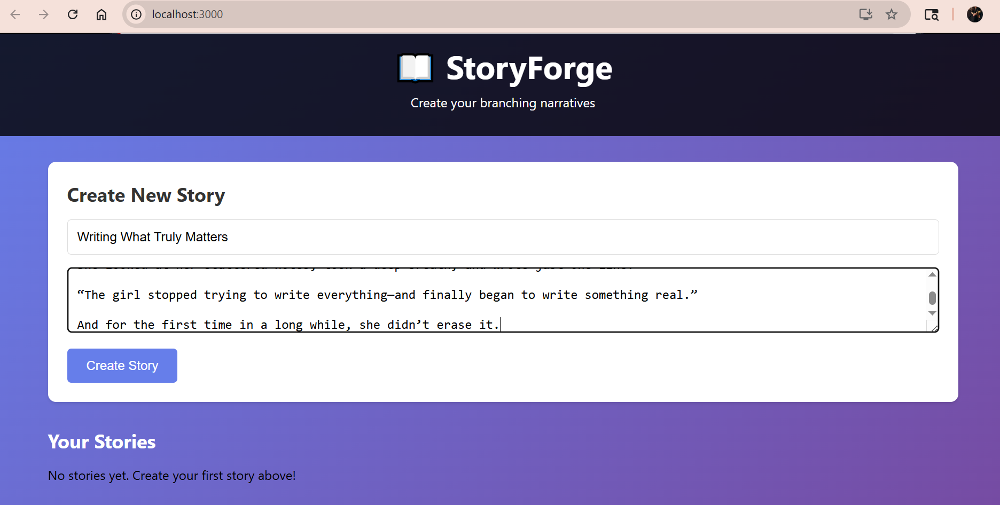
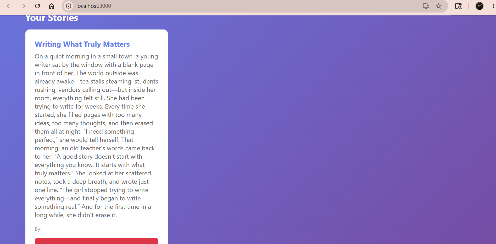

# 📖 StoryForge

A full-stack web application for creating and managing narrative stories. Built with React + Django REST Framework.

## 🎯 Purpose

This project showcases my full-stack development skills.

## 🛠️ Technologies

- **React** - Frontend UI
- **Django REST Framework** - Backend API  
- **Python** - Backend logic
- **SQLite** - Database

## ✨ Features

- Create new stories with title and description
- View all stories in a beautiful grid layout
- Delete stories you no longer need
- RESTful API architecture
## 📸 Screenshots

### Main Interface


### Creating a Story


## 🚀 How to Run

### Backend Setup
```bash
cd backend
python -m venv venv
venv\Scripts\activate
pip install django djangorestframework django-cors-headers
python manage.py migrate
python manage.py runserver
